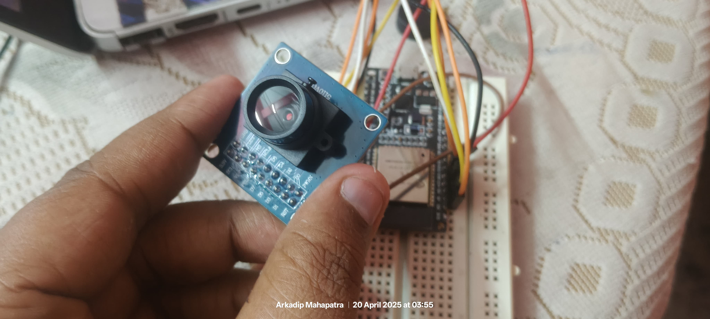

---

 - **OV7670 camera (without FIFO)** 
 - **ESP32 DevKit V1**
 
 ### Run a basic local web server in station mode with a placeholder stream.

---

## ⚙️ Final OV7670 to ESP32 DevKit V1 Pin Connections

| OV7670 Pin | ESP32 Pin (Your Board) | GPIO | Notes                    |
|------------|------------------------|------|--------------------------|
| **VCC**    | 3V3                    | -    | 3.3V ONLY!               |
| **GND**    | GND                    | -    | Ground                   |
| **SDA**    | IO21                   | 21   | SCCB (I2C Data)          |
| **SCL**    | IO22                   | 22   | SCCB (I2C Clock)         |
| **XCLK/ MCLK**   | IO4                    | 4    | Needs PWM/clock signal   |
| **D0**     | IO32                   | 32   | Data line                |
| **D1**     | IO33                   | 33   |                          |
| **D2**     | IO34                   | 34   | Input-only               |
| **D3**     | IO35                   | 35   | Input-only               |
| **D4**     | SN / VN                    | 39   | (GPIO 39, input-only)    |
| **D5**     | SP / VP                    | 36   | (GPIO 36, input-only)    |
| **D6**     | IO18                   | 18   |                          |
| **D7**     | IO19                   | 19   |                          |
| **PCLK**   | IO25                   | 25   | Pixel clock              |
| **VSYNC/ VS**  | IO26                   | 26   | Vertical sync            |
| **HREF/ HS**   | IO27                   | 27   | Horizontal ref           |
| **RESET**  | 3V3                    | -    | Tie to 3.3V (or use GPIO)|
| **PWDN**   | GND                    | -    | Tie to GND (or use GPIO) |

---

## 🛠 `platformio.ini` for PlatformIO

```ini
[env:esp32dev]
platform = espressif32
board = esp32dev
framework = arduino
monitor_speed = 115200
upload_speed = 921600

lib_deps =
  ESPAsyncWebServer
  AsyncTCP
```

---

## 📦 ESP32 Camera Stream Code (HTML + Stream Endpoint)

This is a working local server (LAN) that connects to Mobile/Router WiFi and serves a camera preview page with a placeholder stream:

```cpp
#include <WiFi.h>
#include <ESPAsyncWebServer.h>

const char* ssid = "spa";
const char* password = "12345678";

AsyncWebServer server(80);

void setup() {
  Serial.begin(115200);

  // Connect to WiFi (Station Mode)
  WiFi.begin(ssid, password);
  Serial.print("Connecting to WiFi");
  while (WiFi.status() != WL_CONNECTED) {
    delay(500);
    Serial.print(".");
  }

  Serial.println("\nConnected to WiFi!");
  Serial.println("IP Address: ");
  Serial.println(WiFi.localIP());

  // HTML Page
  server.on("/", HTTP_GET, [](AsyncWebServerRequest *request){
    String html = R"rawliteral(
      <!DOCTYPE html>
      <html>
      <head>
        <title>ESP32 OV7670 Stream</title>
      </head>
      <body>
        <h2>ESP32 Camera Stream</h2>
        
      </body>
      </html>
    )rawliteral";
    request->send(200, "text/html", html);
  });

  // Placeholder stream
  server.on("/stream", HTTP_GET, [](AsyncWebServerRequest *request){
    // This will be replaced with image data later
    request->send(200, "image/jpeg", "", 0);
  });

  server.begin();
}

void loop() {
  // No code here for now
}
```

<!-- ---

### ⚠ Next Step: Actual Camera Support
Since OV7670 doesn’t support JPEG natively and has no FIFO buffer:
- You’ll need **a camera driver** like [Bitluni’s ESP32CameraOV7670](https://github.com/bitluni/ESP32CameraOV7670)
- And a JPEG conversion library like [TJpg_Decoder](https://github.com/bitbank2/JPEGDEC) or software JPEG encoding (slow) -->

---



